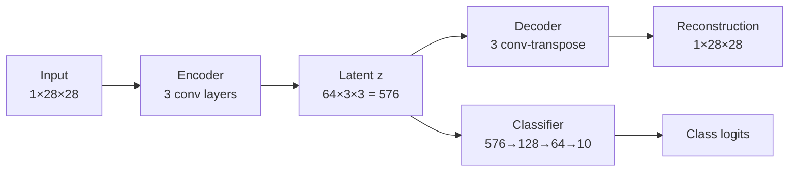

# Open Set Recognition with a Multi-Task Autoencoder

A standard classifier is forced to answer. Show it a sneaker and it will confidently tell you
it's a 4, because "not a digit" isn't in its vocabulary. Open Set Recognition (OSR) is the task
of adding that answer.

This project trains a single network on MNIST that reconstructs, classifies, and shapes its own
latent space at the same time — then uses the geometry it learned to reject inputs it has never
seen. Trained on MNIST only; tested against FashionMNIST and CIFAR-10 as unknowns.

## Problem

In closed-set classification, train and test share a label space $\mathcal{Y}_{in} = \{1,\dots,K\}$.
In OSR, test samples may come from classes that never appeared in training. The model must learn

$$
f(x) = \begin{cases} k \in \mathcal{Y}_{in} & \text{if } x \text{ belongs to known class } k \\ \text{Unknown} & \text{if } x \in \mathcal{Y}_{out} \end{cases}
$$

which requires representations that are compact and well separated for known classes — compact
enough that "far from everything known" becomes a meaningful signal.

## Architecture

Three heads share one encoder, so the latent vector has to satisfy three demands at once.



- **Encoder** $E_\phi$ — maps the image to a latent vector $z$.
- **Decoder** $D_\psi$ — reconstructs from $z$. Forces the latent to retain enough to rebuild the input.
- **Classifier** $C_\theta$ — predicts the digit from $z$. Forces the latent to be separable.

The decoder is what makes rejection possible. A classifier alone learns only the boundaries
*between* digits, and an unknown input lands somewhere in that space with no way to tell it
doesn't belong. Reconstruction gives an absolute measure of "does this look like what I was
trained on" rather than a relative one.

## Training objective

Three losses, summed with equal weight:

$$
\mathcal{L} = \underbrace{\|x - D_\psi(E_\phi(x))\|_2^2}_{\text{reconstruction (MSE)}} + \underbrace{-\sum_k \mathbb{1}(y{=}k)\log C_\theta(E_\phi(x))_k}_{\text{classification (NLL)}} + \underbrace{\max(0, \|z_a - z_p\|_2^2 - \|z_a - z_n\|_2^2 + \alpha)}_{\text{triplet}}
$$

The triplet term is what makes the latent space usable for distance-based rejection: it pulls
same-class samples together and pushes different classes apart, so each class occupies a tight
region instead of a diffuse cloud. Triplets are sampled randomly within each batch (no hard
mining), margin $\alpha = 1$.

**Setup:** 10,000 MNIST training images (subsampled), 90 epochs, batch 1024, Adam at `lr=1e-3`
with `weight_decay=1e-5`, StepLR decay. Seeds fixed at 42. About 8 minutes on a Colab T4.

## Rejection rule — and how it is calibrated

This is the part that matters, so it is spelled out precisely.

After training, two statistics are computed **from the training set only**:

1. **Class radii.** For each known class $k$, the centroid $\mu_k$ of its latent vectors. Points
   beyond the 99.5th percentile of distance are trimmed, the centroid is recomputed, and the
   radius $R_k$ is set to the **99th percentile** of the remaining distances.
2. **Reconstruction threshold.** $\tau$ is the **99.25th percentile** of per-image reconstruction
   MSE on training images.

At inference, a sample is accepted as its predicted class only if **both** hold:

$$
\min_k d(z, \mu_k) \le R_k \quad \text{and} \quad \|x - \hat{x}\|^2 \le \tau
$$

Otherwise it is labelled unknown. Note the first condition is checked against **any** class
hypersphere, not specifically the predicted one — a sample inside any known region passes the
distance test.

**No OOD data is involved in choosing $\mu_k$, $R_k$, or $\tau$.** The model never sees
FashionMNIST or CIFAR-10 until evaluation. This is the difference between a real OSR result and
a threshold tuned until the test numbers look good.

One honest caveat: $\tau$ is calibrated on reconstructions of *training* images, which the model
has partly memorised, so training reconstruction error is lower than it would be on held-out
data. That makes $\tau$ tighter than ideal, which biases toward over-rejection — it costs
in-distribution accuracy and flatters the OOD numbers. Holding out a calibration split would be
the cleaner design.

## Results

| Evaluation | Known (MNIST) | Unknown rejected | Total |
|---|---|---|---|
| Closed-set classification, no rejection | 97.54% | — | — |
| MNIST vs **FashionMNIST** | 96.30% | 99.15% | 97.72% |
| MNIST vs **CIFAR-10** | 96.30% | 99.90% | 98.10% |

Each open-set evaluation uses 2,000 MNIST test images against 2,000 OOD images.

The first row is the reference point: **rejection costs 1.24 points of accuracy on known digits**
(97.54% → 96.30%). That is the trade-off the percentile thresholds buy, and it is the number to
look at when tuning them — a stricter $\tau$ rejects more unknowns and more knowns.

CIFAR-10 is rejected almost perfectly (99.90%), but it is the easier of the two tests: the images
are converted to grayscale and downscaled to 28×28, leaving pixel statistics that look nothing
like a handwritten digit. FashionMNIST is the meaningful benchmark — same resolution, same
grayscale, same centred-object framing — and 99.15% there is the result worth quoting.

The t-SNE projection in the notebook shows why it works: the ten digit classes form compact,
separated clusters, and OOD samples land in the low-density space between them rather than
inside any of them.

## Running it

```bash
pip install -r requirements.txt
jupyter notebook model.ipynb
```

Run the cells in order. Datasets download automatically to `./data`. A GPU is strongly
recommended — the notebook falls back to CPU but training will take considerably longer.

Cell 2 has a mode switch:

```python
eval_mode = False   # True: load OSR_model.pth instead of training
```

`eval_mode = True` skips training and loads a saved model, but note that `.gitignore` excludes
`*.pth`, so no checkpoint ships with this repo — the first run has to train.

## Possible improvements

- Calibrate $\tau$ on a held-out split rather than on training reconstructions.
- Check the distance condition against the *predicted* class hypersphere only, which is stricter
  than the current any-class test.
- Hard negative mining for the triplet loss instead of random sampling.
- Report AUROC over the rejection score, which would characterise the whole
  precision/recall trade-off instead of one operating point.

## License

MIT
